# WorkFlow - Cafe Workspace Platform Design Document

## Overview

WorkFlow is a mobile-first marketplace platform that connects remote workers, freelancers, and students with local cafes offering bookable workspace seats. The platform enables cafes to monetize underutilized space during off-peak hours while providing users with guaranteed, amenity-rich workspaces on-demand.

### Core Value Proposition

- **For Users**: On-demand access to reliable, comfortable workspaces without long-term commitments
- **For Cafes**: New revenue stream through monetization of empty seats during off-peak hours
- **For Platform**: Commission-based revenue model with scalable marketplace dynamics

### Target Market

- Primary launch market: Hyderabad (Madhapur, Gachibowli, Ameerpet, Jubilee Hills)
- User segments: Freelancers, remote employees, university students
- Cafe partners: Independent and small-chain cafes in high-density professional areas

## Technology Stack & Dependencies

The platform utilizes the MERN stack architecture for optimal scalability and modern development practices:

| Component      | Technology           | Purpose                                                                      |
| -------------- | -------------------- | ---------------------------------------------------------------------------- |
| Frontend       | React.js             | Dynamic, responsive user interface for both consumer app and cafe dashboard  |
| Backend        | Node.js + Express.js | Server-side logic and RESTful API development                                |
| Database       | MongoDB              | Flexible NoSQL storage for user profiles, cafe data, and booking information |
| Authentication | JWT + OAuth          | Secure user authentication with social login support                         |
| Payments       | UPI/Card Integration | Secure payment processing for bookings                                       |
| Maps           | Google Maps API      | Location services and cafe discovery                                         |

## Architecture

### System Architecture Overview

### Component Architecture

#### Frontend Components Hierarchy

#### State Management Architecture

| State Domain   | Management Strategy               | Scope           |
| -------------- | --------------------------------- | --------------- |
| Authentication | React Context + Local Storage     | Global          |
| User Profile   | React Context                     | Global          |
| Cafe Discovery | Local Component State + API Cache | Screen-level    |
| Booking Flow   | Local State + Form Management     | Flow-level      |
| Dashboard Data | Local State + API Cache           | Dashboard-level |

### Data Models & Database Design

#### Core Entities

**User Entity**
| Field | Type | Description | Constraints |
|-------|------|-------------|-------------|
| userId | ObjectId | Primary identifier | Required, Unique |
| email | String | User email address | Required, Unique, Validated |
| profile | Object | Name, photo, preferences | Required |
| authProvider | String | google, email | Required |
| createdAt | Date | Account creation timestamp | Auto-generated |
| isActive | Boolean | Account status | Default: true |

**Cafe Entity**
| Field | Type | Description | Constraints |
|-------|------|-------------|-------------|
| cafeId | ObjectId | Primary identifier | Required, Unique |
| name | String | Cafe business name | Required |
| location | Object | Address, coordinates, area | Required |
| amenities | Array | Available workspace features | Required |
| workspaceConfig | Object | Available seats, pricing | Required |
| operatingHours | Object | Daily operating schedule | Required |
| media | Array | Photos and virtual tour links | Optional |
| verification | Object | Business license, KYC status | Required |

**Booking Entity**
| Field | Type | Description | Constraints |
|-------|------|-------------|-------------|
| bookingId | ObjectId | Primary identifier | Required, Unique |
| userId | ObjectId | Reference to User | Required |
| cafeId | ObjectId | Reference to Cafe | Required |
| timeSlot | Object | Start time, duration, end time | Required |
| pricing | Object | Base cost, commission, total | Required |
| status | String | pending, confirmed, completed, cancelled | Required |
| paymentInfo | Object | Transaction details | Required |
| confirmationCode | String | Check-in verification code | Auto-generated |

#### Database Relationships

```mermaid
erDiagram
    User ||--o{ Booking : makes
    Cafe ||--o{ Booking : hosts
    User ||--o{ Review : writes
    Cafe ||--o{ Review : receives
    Booking ||--|| Payment : requires
    Cafe ||--o{ Availability : defines

    User {
        ObjectId userId PK
        string email UK
        object profile
        string authProvider
        date createdAt
        boolean isActive
    }

    Cafe {
        ObjectId cafeId PK
        string name
        object location
        array amenities
        object workspaceConfig
        object operatingHours
        array media
        object verification
    }

    Booking {
        ObjectId bookingId PK
        ObjectId userId FK
        ObjectId cafeId FK
        object timeSlot
        object pricing
        string status
        object paymentInfo
        string confirmationCode
    }
```

## API Endpoints Reference

### User Authentication & Profile

| Endpoint         | Method | Purpose               | Request Schema               | Response Schema |
| ---------------- | ------ | --------------------- | ---------------------------- | --------------- |
| `/auth/register` | POST   | User registration     | `{email, password, profile}` | `{token, user}` |
| `/auth/login`    | POST   | User authentication   | `{email, password}`          | `{token, user}` |
| `/auth/social`   | POST   | Social login (Google) | `{provider, token}`          | `{token, user}` |
| `/profile`       | GET    | Retrieve user profile | Headers: `Authorization`     | `{user}`        |
| `/profile`       | PUT    | Update user profile   | `{profile}`                  | `{user}`        |

### Cafe Discovery & Management

| Endpoint                  | Method | Purpose                 | Request Schema                | Response Schema         |
| ------------------------- | ------ | ----------------------- | ----------------------------- | ----------------------- |
| `/cafes/search`           | GET    | Discover cafes          | Query: `{location, filters}`  | `{cafes[], totalCount}` |
| `/cafes/:id`              | GET    | Cafe profile details    | Params: `{id}`                | `{cafe, availability}`  |
| `/cafes/:id/availability` | GET    | Real-time availability  | Query: `{date, duration}`     | `{timeSlots[]}`         |
| `/cafes/register`         | POST   | Cafe partner onboarding | `{cafeDetails, verification}` | `{cafeId, status}`      |

### Booking Management

| Endpoint                | Method | Purpose               | Request Schema                | Response Schema               |
| ----------------------- | ------ | --------------------- | ----------------------------- | ----------------------------- |
| `/bookings`             | POST   | Create new booking    | `{cafeId, timeSlot, payment}` | `{booking, confirmationCode}` |
| `/bookings`             | GET    | User booking history  | Query: `{status, page}`       | `{bookings[], pagination}`    |
| `/bookings/:id`         | PUT    | Modify booking        | `{timeSlot, status}`          | `{booking}`                   |
| `/bookings/:id/checkin` | POST   | Check-in verification | `{confirmationCode}`          | `{status, timestamp}`         |

### Payment Processing

| Endpoint             | Method | Purpose               | Request Schema                | Response Schema      |
| -------------------- | ------ | --------------------- | ----------------------------- | -------------------- |
| `/payments/initiate` | POST   | Start payment process | `{bookingId, amount, method}` | `{paymentIntent}`    |
| `/payments/confirm`  | POST   | Confirm payment       | `{paymentIntentId, status}`   | `{booking, receipt}` |
| `/payments/refund`   | POST   | Process refund        | `{bookingId, reason}`         | `{refundStatus}`     |

### Authentication Requirements

- **User Endpoints**: Require JWT token in Authorization header
- **Cafe Dashboard**: Require cafe partner authentication + role verification
- **Admin Endpoints**: Require admin role + elevated permissions
- **Public Endpoints**: Cafe discovery and basic cafe information

## Business Logic Layer

### User Booking Flow Architecture

### Cafe Availability Management

The system maintains real-time availability through a combination of:

1. **Static Configuration**: Cafes define base availability schedules
2. **Dynamic Blocking**: Real-time updates for maintenance, events, or capacity changes
3. **Booking Reconciliation**: Automatic availability updates when bookings are made/cancelled
4. **Buffer Management**: Built-in time buffers between bookings for table turnover

### Revenue & Commission Processing

| Transaction Type | Platform Commission             | Cafe Revenue               | Processing        |
| ---------------- | ------------------------------- | -------------------------- | ----------------- |
| Hourly Booking   | 20% of total booking value      | 80% of total booking value | Weekly payout     |
| Cancellation     | Retain processing fee           | Refund booking amount      | Immediate         |
| No-Show          | Platform + Cafe retain 50% each | 50% penalty retention      | Next payout cycle |

### Search & Discovery Algorithm

The cafe discovery system prioritizes results based on:

1. **Proximity**: Distance from user's current/searched location
2. **Availability**: Real-time seat availability for requested time slots
3. **Amenity Match**: Alignment with user's filtered requirements
4. **Rating Score**: User-generated ratings and review quality
5. **Booking History**: User's previous positive experiences

## State Management

### User Application State Architecture

### State Persistence Strategy

| State Domain     | Storage Method          | Persistence Level | Sync Strategy                  |
| ---------------- | ----------------------- | ----------------- | ------------------------------ |
| Authentication   | Secure Storage + Memory | Long-term         | Server validation on app start |
| User Preferences | Local Storage           | Long-term         | Periodic background sync       |
| Search Filters   | Session Storage         | Session-only      | Reset on app restart           |
| Booking Cache    | Memory + API Cache      | Short-term        | Real-time validation           |

## Routing & Navigation

### User Application Navigation Structure

### Cafe Dashboard Navigation

| Section                 | Purpose                               | Access Control     |
| ----------------------- | ------------------------------------- | ------------------ |
| Dashboard Home          | Overview metrics and daily bookings   | Cafe Owner + Staff |
| Availability Management | Set working hours and block dates     | Cafe Owner Only    |
| Booking Management      | View and manage customer bookings     | Cafe Owner + Staff |
| Profile Settings        | Update cafe information and amenities | Cafe Owner Only    |
| Analytics & Payouts     | Revenue tracking and payment history  | Cafe Owner Only    |

## API Integration Layer

### External Service Integration

**Google Maps Integration**

- Purpose: Location services, geocoding, and map visualization
- Implementation: React Google Maps component with custom markers
- Data Flow: User location → Nearby cafe discovery → Route planning

**Payment Gateway Integration**

- Supported Methods: UPI, Credit/Debit Cards, Net Banking
- Security: PCI DSS compliant payment processing
- Flow: Payment initiation → Gateway redirect → Webhook confirmation → Booking confirmation

**Notification Services**

- Email: Booking confirmations, reminders, and promotional content
- SMS: Critical notifications and booking verification codes
- Push Notifications: Real-time booking updates and promotional offers

### API Response Caching Strategy

| Endpoint Category | Cache Duration | Invalidation Trigger              |
| ----------------- | -------------- | --------------------------------- |
| Cafe Static Data  | 6 hours        | Cafe profile updates              |
| User Profile      | 1 hour         | Profile modifications             |
| Availability Data | 5 minutes      | New bookings or cancellations     |
| Search Results    | 15 minutes     | Location change or filter updates |

## Testing Strategy

### Unit Testing Framework

**Backend Testing (Node.js + Express)**

- Framework: Jest + Supertest
- Coverage: Business logic functions, API endpoint handlers, database operations
- Mock Strategy: Database connections, external API calls, payment processing

**Frontend Testing (React)**

- Framework: Jest + React Testing Library
- Coverage: Component rendering, user interactions, state management
- Mock Strategy: API calls, navigation, external service integrations

### Integration Testing Approach

| Test Category       | Scope                             | Tools                        | Frequency      |
| ------------------- | --------------------------------- | ---------------------------- | -------------- |
| API Integration     | Full request-response cycles      | Postman + Newman             | Pre-deployment |
| Database Operations | CRUD operations + complex queries | Jest + MongoDB Memory Server | Daily          |
| Payment Flow        | End-to-end payment processing     | Sandbox environments         | Pre-release    |
| User Journey        | Complete booking workflows        | Cypress                      | Weekly         |

### Testing Data Management

**Test Environment Strategy**

- Development: Local MongoDB with seed data
- Staging: Shared MongoDB instance with production-like data
- Production: Live environment with monitoring and rollback capabilities

**Test Data Categories**

- User Accounts: Various user types and authentication states
- Cafe Profiles: Different amenity combinations and availability patterns
- Booking Scenarios: Various time slots, pricing models, and edge cases
